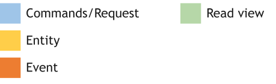
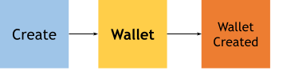
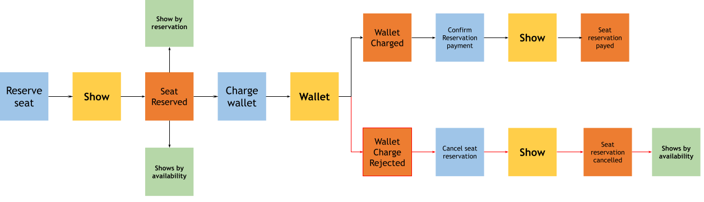
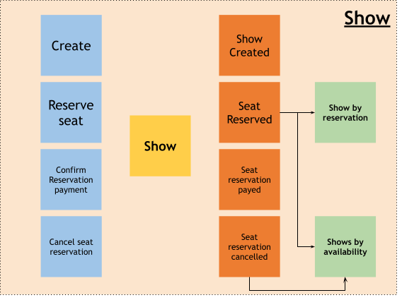
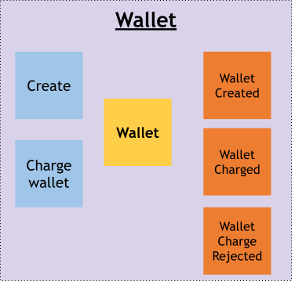
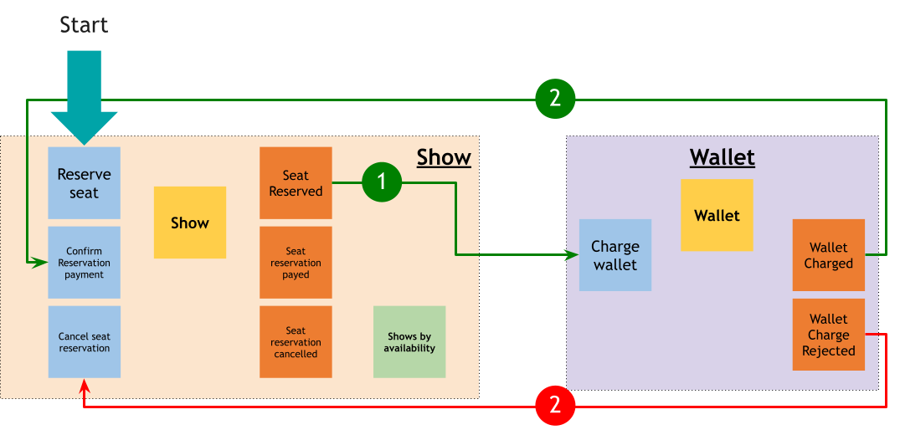
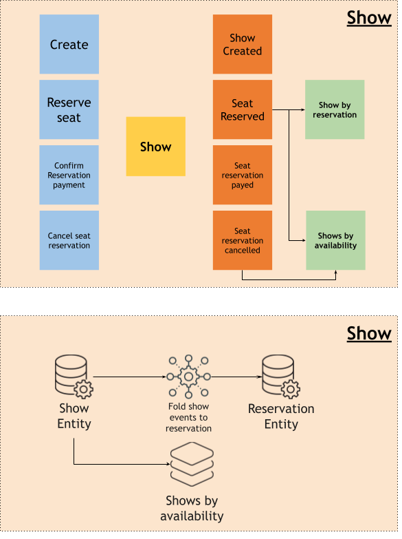
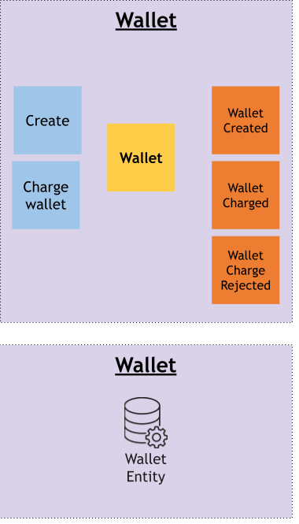
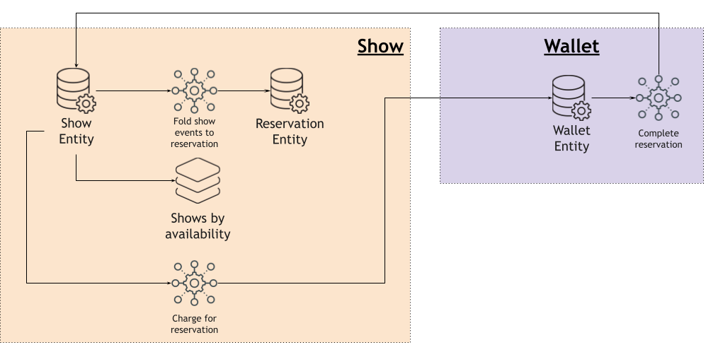

# Cinema Booking sample

## Prerequisites
- Java 21 or later
- Apache Maven 3.6 or higher
- Docker 20.10.14 or higher (client and daemon)
- cURL
- IDE / editor

## Kalix SDK
Kalix offers different SDKs.
This example is built using the [Kalix Java SDK](https://docs.kalix.io/java/index.html).
Kalix is API first and with Kalix Java SDK, code (`Record`, `Class`) will be used to describe domain and API data structures.

# Designing Kalix Services

## Use case definition


Our Cinema booking system allows customers to book cinema show seats and pay using their imaginary e-wallet.
1. The cinema show manager creates a show with a number of seats available
2. The customer creates an e-wallet with initial resources
3. The customer searches for shows with available seats
4. The customer reserves seats for a show
5. Payment for the reserved seats is done via e-wallet

## Event storming

For designing the cinema booking system we are going to use Tactical [EventStorming](https://en.wikipedia.org/wiki/Event_storming).

### Entities / Aggregate Roots


Legend<br>


#### Show

Show entity business data model:
```java
public record Show(
   String id,
   String title,
   Map<Integer, Seat> seats,
   Map<String, Integer> pendingReservations,
   Map<String, FinishedReservation> finishedReservations
) {}

public record Seat(
   int number, 
   SeatStatus status, 
   BigDecimal price
) {}

public enum SeatStatus {
  AVAILABLE, RESERVED, PAID
}
```

In addition to the show `id` and `title`, the show has a list of `seats` where each seat has an index `number`, `status` (`AVAILABLE`, `RESERVED`, `PAID`) and `price`.<br>
`pendingReservations`, bookings that are not paid yet and `finishedReservations` that are paid.

#### Wallet

Wallet entity business data model:
```java
public record Wallet(String id, BigDecimal balance, Map<String, Expense> expenses) {}
public record Expense(String expenseId, BigDecimal amount) {}
```

In addition to the wallet `id`, `balance` represents the available amount, `expenses` represents all expenses done using this instance of the wallet (indexed by unique `expenseId`).
Each `expense` has a unique `expenseId` and amount that was expensed! 

### Commands & Domain Events
#### Create show & search show


`CreateShow` command initiates creation of the Show by emitting `ShowCreated` domain event.<br>

`CreateShow` data model:
```java
record CreateShow(String title, int maxSeats) {}
```
**Note:** `showId` is not explicitly part of the model but is set implicitly.

`ShowCreated` data model:
```java
record ShowCreated(String showId, String title, List<Seat> seats) {}
```
Based on the `ShowCreated` domain event, a `Show by availability` read view is updated.<br>
The `Show by availability` view is used to search for shows based on their availability.

View Data model:
```java
record ShowsByAvailableSeatsViewRecord(String showId, String title, int availableSeats) {}
```

The initial value of `availableSeats` is total number of seats for the show (`seats.size()`).

#### Create Wallet



The `CreateWallet` command initiates creation of the wallet with an initial balance by emitting `WalletCreated` domain event.

`CreateWallet` data model:
```java
 record CreateWallet(BigDecimal initialAmount) {}
```
**Note:** `walletId` is not explicitly part of the model but is set implicitly.

`WalletCreated` domain event data model:
```java
record WalletCreated(String walletId, BigDecimal initialAmount) {}
```

#### Book & Pay the show flow

The "Book and Pay" flow is a transactional flow that spans over two Entities (Show and Wallet). This requires a distributed transaction or using the Saga pattern.<br>
In this use case we are going to use _choreography_-based Saga pattern.



##### Reserve Seat for a show

After the customer has chosen the show they want to book, the `ReserveSeat` command initiates the seat reservation. 
If the requested seat number is available, the `SeatReserved` domain event will be emitted, reserving the specified seat.

`ReserveSeat` command data model:
```java
record ReserveSeat(String walletId, String reservationId, int seatNumber) {}
```

Reserve seat requires `walletId`, the id of the wallet instance that is used to pay the seat reservation, 
`reservationId` that uniquely identifies the reservation, and a `seatNumber`, the seat index.

`SeatReserved` domain event data model:
```java
record SeatReserved(String showId, String walletId, String reservationId, int seatNumber, BigDecimal price, int availableSeatsCount) {}
```

`price` is a price of a chosen seat that needs to be charged on wallet. <br>
`availableSeatsCount` represents the count of available seats after this reservation.<br>
When the seat is reserved, it changes the seat's `SeatStatus` to `RESERVED`.

As with the `ShowCreated` domain event, the "Show by availability" read view is also updated based on the `SeatReserved` domain event (using `availableSeatsCount`).

Also, based on the `SeatReserved` domain event, the `Show by reservation` read view is created to be able to map the reservation to the show (more information why this is needed will be explained in following sections).

View Data model:
```java
public record Reservation(String reservationId, String showId, String walletId, BigDecimal price) {}
```

The initial value of `availableSeats` is the total number of seats for the show (`seats.size()`).
To be able to map `reservationId` to `showId`, the "Show by reservation" read view is updated.

#### Charge wallet based on the seat reservation

Based on the `SeatReserved` domain event, the `ChargeWallet` command initiates to charge the wallet.<br> 
`walletId` from `SeatReserved` is used to identify the instance of the wallet that needs to be charged.<br>
`reservationId` from `SeatReserved` is used as unique wallet charge request identifier (`expenseId`) and connects the reservation to the wallet charge for future reference.<br>
`amount` for charge is the seat price.<br>

`ChargeWallet` command data model:
```java
record ChargeWallet(BigDecimal amount, String expenseId) {}
```

In case of a successful charge, the wallet emits a `WalletCharged` domain event. In case of any error, the wallet emits a `WalletChargeRejected` domain event. <br>
The `WalletCharged` domain event triggers a successful Saga "route" and `WalletChargeRejected` a compensation Saga "route".

`WalletCharged` data model:
```java
record WalletCharged(String walletId, BigDecimal amount, String expenseId) {}
```

`WalletChargeRejected` data model:
```java
record WalletChargeRejected(String walletId, String expenseId) {}
```

#### "Wallet successfully charged" route

Based on `WalletCharged` domain event, the `ConfirmReservationPayment` command initiates finishing of seat booking flow by emitting the domain event `SeatReservationPaid`. <br>
The `expenseId` from `WalletCharged` domain event is used as a `reservationId`.<br> 

**Note:** To be able to send a `ConfirmReservationPayment` command to the correct instance of a show, the "Show by reservation" read view is used to get `showId` based on `reservationId`.

`SeatReservationPaid` data model:
```java
record SeatReservationPaid(String showId, String reservationId, int seatNumber) {}
```

When a seat is reserved, the seat's `SeatStatus` is changed to `PAYED`.

#### Failed charge, compensation route

In case of a failed charge, the compensation route needs to cancel the reservation to free the reserved seat.<br>
Based on the `WalletChargeRejected` domain event, the `CancelSeatReservation` command initiates removal of the seat reservation by emitting the domain event `SeatReservationCancelled`.
`expenseId` from the `WalletChargeRejected` domain event is used as a `reservationId`.<br>

**Note:** To be able to send the `CancelSeatReservation` command to the right instance of the show, "Show by reservation" read view is used to get `showId` based on the `reservationId`.

`CancelSeatReservation` data model:
```java
record CancelSeatReservation(String reservationId) implements ShowCommand {}
```

`SeatReservationCancelled` data model:
```java
record SeatReservationCancelled(String showId, String reservationId, int seatNumber,int availableSeatsCount) {}
```

Like with the `ShowCreated` and `SeatReserved` domain events, the "Show by availability" read view is also updated based on the `SeatReservationCancelled` domain event (using `availableSeatsCount`).


## Bounded contexts

We have two bounded contexts, _Show_ and _Wallet_, with corresponding commands, domain events and read views.
### Show

### Wallet


## Context map
The interaction between the _Show_ and _Wallet_ bounded contexts is defined by "Book & Pay the show flow".


The Show and Wallet bounded contexts interact in 3 interaction points:
- The Show's `SeatReserved` domain event triggers the Wallet's `ChargeWallet` command
- The Wallet's `WalletCharged` domain event triggers the Show's `ConfirmPaymentConfirmation` command
- The Wallet's `WalletChargeRejected` domain event triggers the Show's `CancelSeatReservation` command

## Non-functional requirements
- effective asynchronous event driven communication
    - a common pattern to facilitate asynchronous, event-driven communication is to use a message broker as a data plane between bounded contexts, but it introduces another moving part
- strong delivery semantics
    - cannot lose any events
    - at-least-once delivery is required
- idempotency
    - deduplication with at-least-once delivery
- event ordering
    - ensure consistency
- design for failure
    - business or technical
- scalability
    - to be able to scale based on the demand

## Kalix components
[Kalix components](https://docs.kalix.io/concepts/programming-model.html#_kalix_components) abstract Kalix functionalities in high level building blocks.
Designing Kalix services is an exercise of combining and connecting Kalix components using domain driven design patterns.

### Show


For designing the "Show" bounded context in Kalix we are goning to use these Kalix components:
1. Show (Entity/Aggregate) - [Kalix Entity (Event sourced)](https://docs.kalix.io/java/event-sourced-entities.html)
2. "Shows by availability" read view - [Kalix View](https://docs.kalix.io/java/value-entity.html)
3. Show by reservation - [Kalix Entity (Value)](https://docs.kalix.io/java/views.html) and [Kalix Action](https://docs.kalix.io/java/actions.html)<br>

**Note:** More information around implementing these Kalix components will be covered in following sections  

#### "Show" Entity

The Show entity is implemented using a [Kalix Entity (Event sourced)](https://docs.kalix.io/java/event-sourced-entities.html). More info about the event sourced state model can be found [here](https://docs.kalix.io/concepts/state-model.html#_the_event_sourced_state_model).<br>

#### "Show by availability" View

Shows by availability read view will be implemented using [Kalix View](https://docs.kalix.io/java/value-entity.html). 
Kalix View will `subscribe` to `ShowEntity` domain events and facilitate building and exposing read view of shows by availability.

#### "Reservation" Entity

The Kalix View component is a default candidate for a read view, but not the only one. A [Kalix Entity (Value)](https://docs.kalix.io/java/views.html) could also be used to facilitate an implementation of a read view. 
The main advantages of a Kalix Entity over a Kalix View is providing an in-memory read view access in opposite to a Kalix View that is not kept in memory. A Kalix Entity can be used as a read view only if the read is view is queryable via a key/id.

In case of the "Show by reservation" view, a Kalix Entity is a suitable solution where `ReservationEntity` is modeled around a reservation and access via `reservationId` possible, it stores a reference to "Show" as `showId`. 
To be able to create instances of `ReservationEntity`, a "Fold show events to reservation" [Kalix Action](https://docs.kalix.io/java/actions.html) component is required to facilitate `subscribe` to `ShowEntity` events and to send `Create` command to `ReservationEntity`.

### Wallet



For designing the Wallet bounded context in Kalix we are going to use for implementing Wallet (Entity/Aggregate) - [Kalix Entity (Event sourced)](https://docs.kalix.io/java/event-sourced-entities.html).

**Note:** More information around implementing these Klaix service will be covered in following sections

#### "Wallet" Entity

As the Show entity, the Wallet entity will be implemented using a [Kalix Entity (Event sourced)](https://docs.kalix.io/java/event-sourced-entities.html). More info about the event sourced state model can be found [here](https://docs.kalix.io/concepts/state-model.html#_the_event_sourced_state_model).

### Context map



For the interaction between Show and Wallet, the implementation of our "Book & Pay the show" _choreography_-based Saga pattern uses a [Kalix Action](https://docs.kalix.io/java/actions.html) to facilitate asynchronous event-driven communication.

**Note:** Kalix does not require the use of message broker for asynchronous event-driven communication.

# Kickstart a Kalix development project

## Maven archetype

A Kalix Maven archetype is used to generate a recommended project structure:

```shell
mvn archetype:generate \
  -DarchetypeGroupId=io.kalix \
  -DarchetypeArtifactId=kalix-spring-boot-archetype \
  -DarchetypeVersion=latest
```

```
Define value for property 'groupId': `com.example`<br>
Define value for property 'artifactId': `java-spring-cinema-booking-choreography`<br>
Define value for property 'version' 1.0-SNAPSHOT: :<br>
Define value for property 'package' com.example: : `com.example`<br>
```

## Import the generated project into your IDE/editor

The generated Maven project has all required Maven plugins and dependencies needed to develop, test, run and deploy Kalix services.

## Adding additional, non-mandatory dependencies

Additional dependencies that are NOT mandatory for developing Kalix service but are convenient to be used in different situations (more explained in following sections).<br>
Add following dependencies in pom.xml:
```
<dependency>
  <groupId>io.vavr</groupId>
  <artifactId>vavr</artifactId>
  <version>0.10.4</version>
</dependency>
<dependency>
  <groupId>org.assertj</groupId>
  <artifactId>assertj-core</artifactId>
  <version>3.23.1</version>
  <scope>test</scope>
</dependency>
<dependency>
  <groupId>org.awaitility</groupId>
  <artifactId>awaitility</artifactId>
  <version>4.2.0</version>
</dependency>
```

`vavr` library is used to provide support for:
- immutable collections
- Either support 

`assertj` library is used as an alternative to standard `JUnit` assertions.<br>

`awaitility` library that offers convenient way to implement asynchronous tests.

## Java 21

The Kalix Maven archetype currently generates a Maven project configured for Java 17, update `pom.xml` to enable Java 21:
```xml
<jdk.target>21</jdk.target>
```
Add in `properties`:
```xml
<java.version>21</java.version>
```

# Develop Kalix components for the "Show" bounded context
## Describe Data structures

With the Kalix Java SDK we are going to use Java code to describe the domain and the API.<br>

The API includes:
- Commands (requests)
- Responses 
- Read View data model

The Domain includes:
- Entity state
- Domain Events

### API data structures

**Tip:** Check the `com.example.cinema.model.CinemaApiModel` Java Class for a reference implementation.

### Domain Events data structure

**Tip:** Check the `com.example.cinema.model.ShowEvent` Java Interface for a reference implementation.<br>

**Note:** A Java _sealed interface_ is used to allow the Java compiler to verify that all events have been handled in the event handler. 

### Show entity state data structure and business domain logic encapsulation

Modeling the domain business logic without an explicit dependency to the Kalix Entity is a good pattern that enables better decoupling and portability.
The domain business logic includes processing of commands, in command handlers, which result in events (required state changes) or errors.

To be able to express this behaviour we are going to use `io.vavr.control.Either` from the `vavr.io` dependency.

For making the data immutable we are going to use an immutable collection implementation by `vavr.io`.

Show data model:
```java
public record Show(String id, String title, Map<Integer, Seat> seats,
                   Map<String, Integer> pendingReservations,
                   Map<String, FinishedReservation> finishedReservations, int availableSeats) {}
```

`handleReservation` command handler:
```java
public Either<CinemaApiModel.ShowCommandError, ShowEvent> handleReservation(CinemaApiModel.ShowCommand.ReserveSeat reserveSeat) {
    int seatNumber = reserveSeat.seatNumber();
    if (isDuplicate(reserveSeat.reservationId())) {
        return left(DUPLICATED_COMMAND);
    } else {
        return seats.get(seatNumber).<Either<CinemaApiModel.ShowCommandError, ShowEvent>>map(seat -> {
            if (seat.isAvailable()) {
                return right(new ShowEvent.SeatReserved(id, reserveSeat.walletId(), reserveSeat.reservationId(), seatNumber, seat.price(), availableSeats()-1));
            } else {
                return left(SEAT_NOT_AVAILABLE);
            }
        }).getOrElse(left(SEAT_NOT_FOUND));
    }
}
private boolean isDuplicate(String reservationId) {
    return pendingReservations.containsKey(reservationId) ||
            finishedReservations.get(reservationId).isDefined();
}
```

**Note**: `isDuplicate` is used to ensure _idempotency_
**Tip:** Check the `com.example.cinema.model.Show` Java Record for a reference implementation.

#### Unit test business domain logic

It is good practice to unit test business domain logic. This is not Kalix specific but ensures that the business domain logic is behaving as expected.

An example of a unit test:
```java
@Test
public void shouldCreateTheShow() {
    //given
    String showId = randomShowId();
    var createShow = randomCreateShow();
   
    //when
    var showCreated = Show.ShowCreator.create(showId, createShow).get();
    var show = Show.create(showCreated);
   
    //then
    assertThat(show.id()).isEqualTo(showId);
    assertThat(show.title()).isEqualTo(createShow.title());
    assertThat(show.seats()).hasSize(createShow.maxSeats());
}
```

**Tip:** Check in `com.example.cinema.ShowTest` in directory `test/java`, the unit test class.<br>
**Note:** `DomainGenerators`, `ShowBuilder` and `ShowCommandGenerators` are helper classes for test data generation. 


#### Run unit tests

```shell
mvn test
```

## Develop the "Show" Entity

The `ShowEntity` will be implemented using a [Kalix Entity (Event sourced)](https://docs.kalix.io/java/event-sourced-entities.html).

The Kalix entity encapsulates the domain business logic and exposes it via endpoints. `ShowEntity` encapsulates and exposes `com.example.cinema.model.Show`.<br>

The entity ID or key is `showId`.

```java
@Id("id")
@TypeId("cinema-show")
@RequestMapping("/cinema-show/{id}")
public class ShowEntity extends EventSourcedEntity<Show, ShowEvent> {

  @PostMapping
  public Effect<Response> create(@PathVariable String id, @RequestBody CreateShow createShow) {}

  @PatchMapping("/reserve")
  public Effect<Response> reserve(@RequestBody ReserveSeat reserveSeat) {}

  @PatchMapping("/cancel-reservation/{reservationId}")
  public Effect<Response> cancelReservation(@PathVariable String reservationId) {}

  @PatchMapping("/confirm-payment/{reservationId}")
  public Effect<Response> confirmPayment(@PathVariable String reservationId) {}

  @GetMapping
  public Effect<ShowResponse> get() {}

  @GetMapping("/seat-status/{seatNumber}")
  public Effect<Show.SeatStatus> getSeatStatus(@PathVariable int seatNumber) {}

  @EventHandler
  public Show onEvent(ShowCreated showCreated) { }

  @EventHandler
  public Show onEvent(SeatReserved seatReserved) { }

  @EventHandler
  public Show onEvent(SeatReservationCancelled seatReservationCancelled) {}

  @EventHandler
  public Show onEvent(SeatReservationPaid seatReservationPaid) {}
}
```

The `ShowEntity` class extends `EventSourcedEntity<Show, ShowEvent>`, with `Show` as its state data model and `ShowEvent` as its domain event interface.

`ShowEntity` class requires three class level annotations:
- `@Id` and `@TypeId` - Kalix annotations to configure the Kalix Entity
- `@RequestMapping` - Spring web annotation to define Kalix Entity instance request mapping

Each `Show` command will be exposed by `ShowEntity` using a corresponding HTTP/REST endpoint. Endpoints in Kalix Entities are methods with:
- a method level Spring web annotation,
- an input variable level Spring web annotation, and
- a reply of type `Effect` with an endpoint response model type. `Effect` is a declarative way to instruct Kalix what needs to be performed.  

Because we are using event sourcing, we also need to provide methods for each `ShowEvent` type that is annotated with `@EventHandler`. Each method will be used to update the `Show` state. 
The reply type is immutable is a `Show`.<br>

`CreateShow` command handler implementation:
```java
@PostMapping
public Effect<Response> create(@PathVariable String id, @RequestBody CreateShow createShow) {
    if (currentState() != null) {
      return effects().error("show already exists", BAD_REQUEST);
    } else {
      return Show.ShowCreator.create(id, createShow).fold(
        error -> errorEffect(error, createShow),
        showCreated -> persistEffect(showCreated, "show created")
      );
    }
}
```

Via the `currentState()` helper method, Kalix gives us access to the current state.

Kalix ensures that each command handler endpoint, on a level of one instance of a Kalix Entity, is called in sequence, ensuring a sequential and consistent way of changing state.

`ShowCreated` event handler implementation:
```java
@EventHandler
public Show onEvent(ShowCreated showCreated) {
    return Show.create(showCreated);
}
```

**Note:** The `ShowEvent` sealed interface will give us a compile-time check that all event handlers are implemented.<br>
**Tip:** Check the `com.example.cinema.ShowEntity` class for a complete reference implementation.<br>

## Show Entity unit test
More information about Kalix Event source entity testing can be found [here](https://docs.kalix.io/java-protobuf/event-sourced-entities.html#_testing_the_entity).
For testing the Kalix Entity, the Kalix Testkit is used (`EventSourcedTestKit`).

```java
@Test
public void shouldReserveAndConfirmSeat() {
    //given
    var showId = randomShowId();
    var walletId = randomWalletId();
    var reservationId = randomReservationId();
    var maxSeats = 100;
    int seatNumber = 1;
    EventSourcedTestKit<Show, ShowEvent, ShowEntity> testKit = EventSourcedTestKit.of(ShowEntity::new);
    var createShow = new CinemaApiModel.ShowCommand.CreateShow("title", maxSeats);
    var reserveSeat = new CinemaApiModel.ShowCommand.ReserveSeat(walletId, reservationId, seatNumber);
    
    //when
    testKit.call(s -> s.create(showId, createShow));
    testKit.call(s -> s.reserve(reserveSeat));
    EventSourcedResult<CinemaApiModel.Response> result = testKit.call(s -> s.confirmPayment(reservationId));
    
    //then
    var confirmedSeat = testKit.getState().seats().get(seatNumber).get();
    assertThat(confirmedSeat.number()).isEqualTo(seatNumber);
    assertThat(confirmedSeat.status()).isEqualTo(PAID);
    
    var availableSeats = testKit.getState().availableSeats();
    assertThat(availableSeats).isEqualTo(maxSeats-1);
}
```

`EventSourcedTestKit` facilitates unit testing of Kalix Event source entities by providing ways to assert emitted events and updated state.

**Tip:** Check in `com.example.cinema.ShowEntityTest` in `test/java`, for a complete test implementation.

### Run unit test

```shell
mvn test
```

## Run & test locally

### Run
Kalix provides a frictionless and efficient local development experience.

In your terminal, with a single command `mvn kalix:runAll` the Kalix service is run locally and exposed at `http://localhost:9000`.

```shell
mvn kalix:runAll
```

### Test
Create show:

```shell
curl -XPOST -d '{
  "title": "title",
  "maxSeats": 5
}' http://localhost:9000/cinema-show/1 -H "Content-Type: application/json"
```

Reserve a seat:
```shell
curl -XPATCH -d '{
  "walletId": "title",
  "reservationId": "res1",
  "seatNumber": 1
}' http://localhost:9000/cinema-show/1/reserve -H "Content-Type: application/json"
```

Confirm seat payment:
```shell
curl -XPATCH http://localhost:9000/cinema-show/1/confirm-payment/res1 -H "Content-Type: application/json"
```
Get:
```shell
curl -XGET http://localhost:9000/cinema-show/1 -H "Content-Type: application/json"
```

## Developing the "Shows By Availability" View
The "Shows by availability" read view will be implemented using a [Kalix View](https://docs.kalix.io/java/value-entity.html).

To implement a Kalix View we need to:
1. define a read view model - already defined with `CinemaApiModel.ShowsByAvailableSeatsViewRecord`
2. define a source, in form of a subscription, from which we want to build the read view 
3. define transformation methods for the source types
4. define how the read data model needs to be queried
5. expose a query method as HTTP/REST endpoint

```java
@ViewId("show_by_available_seats_view")
@Table("show_by_available_seats")
@Subscribe.EventSourcedEntity(value = ShowEntity.class, ignoreUnknown = true)
public class ShowsByAvailableSeatsView extends View<ShowsByAvailableSeatsViewRecord> {

  @GetMapping("/cinema-shows/by-available-seats/{requestedSeatCount}")
  @Query("SELECT * as list FROM show_by_available_seats WHERE availableSeats >= :requestedSeatCount")
  public ShowsByAvailableSeatsRecordList getShows(@PathVariable Integer requestedSeatCount) {
    return null;
  }

  public UpdateEffect<ShowsByAvailableSeatsViewRecord> onEvent(ShowCreated created) {
    return effects().updateState(new ShowsByAvailableSeatsViewRecord(created.showId(), created.title(), created.seats().size()));
  }

  public UpdateEffect<ShowsByAvailableSeatsViewRecord> onEvent(SeatReserved reserved) {
    return effects().updateState(viewState().updateAvailableSeats(reserved.availableSeatsCount()));
  }
  public UpdateEffect<ShowsByAvailableSeatsViewRecord> onEvent(SeatReservationCancelled cancelled) {
    return effects().updateState(viewState().updateAvailableSeats(cancelled.availableSeatsCount()));
  }
}
```


The `ShowsByAvailableSeatsView` class extends `View<ShowsByAvailableSeatsViewRecord>`

1. define a read view model:<br> 
   The read view model is already defined with `CinemaApiModel.ShowsByAvailableSeatsViewRecord`<br>
   Kalix uses the `ShowsByAvailableSeatsViewRecord` read data model to provision a cosponsoring database table.
2. define a source:<br>
   The class level annotation `@Subscribe.EventSourcedEntity` defines a source<br>
   It configures a view subscription to domain event changes from a Kalix Entity (`value = ShowEntity.class` indicates the Entity type).
3. define transformation methods:<br> 
   For each Kalix Entity domain event, that View is subscribed to, we need to implement a transformation method from the domain event data model to the read data model (`ShowEvent` -> `ShowsByAvailableSeatsViewRecord`)<br>
   Similar as with Kalix Entity endpoints, the reply type of the transformation methods is `UpdateEffect` (declarative way to instruct Kalix what needs to be performed).<br> 
4. define how the read data model needs to be queried:<br> 
   Kalix `@Query` annotation that configures what kind of query read model supports. An SQL-like language is used to describe the query.<br>
   Kalix uses this query to index the provisioned table from #1 accordingly
5. expose query method as HTTP/REST endpoint: <br>
   To expose read model via HTTP/REST endpoint class method needs to be added with:
   - a method level Spring web annotation
   - an input variable (query parameters) level Spring web annotation
   - reply type: it can be a single view record, list or stream (using the Spring RactorX Mono type)

The `ShowsByAvailableSeatsView` class requires additionally two class level annotations:
- `@ViewId`- Kalix annotations to configure unique id of the view
- `@Table`- Kalix annotations to configure view table name

**Tip:** Check the `com.example.cinema.ShowsByAvailableSeatsView` class for a complete reference implementation.<br>

## View integration test

More information about Kalix View testing can be found [here](https://docs.kalix.io/java/views.html#_testing_the_view).

Kalix Views depend on the _Kalix Runtime_, so the Kalix integration test testkit needs to be used (test class needs to extend `KalixIntegrationTestKitSupport`).

**Note:** More info about the _Kalix Runtime_ can be found [here](https://docs.kalix.io/concepts/programming-model.html#_kalix_services)<br>

The Kalix integration test testkit is responsible for running the _Kalix Runtime_ in a Docker container using _Test Containers_ and connecting it with the _Service test_ that is running.

```java
@DirtiesContext
@SpringBootTest(classes = Main.class)
class ShowsByAvailableSeatsViewIntegrationTest extends KalixIntegrationTestKitSupport {

  @Autowired
  private ShowCalls calls;

  private Duration timeout = Duration.ofSeconds(10);

  @Test
  public void shouldUpdateShowByAvailableSeatsEntry() {
    //given
    var showId = TestUtils.randomId();
    var showTitle = "title";
    var showTitleSearch = showTitle;
    var maxSeats = 100;
    var reservationId1 = TestUtils.randomId();
    var reservationId2 = TestUtils.randomId();
    var walletId = TestUtils.randomId();
    calls.createShow(showId, showTitle, maxSeats);

    //when
    calls.reserveSeat(showId, walletId, reservationId1, 3);
    calls.reserveSeat(showId, walletId, reservationId2, 4);

    //then
    List<CinemaApiModel.ShowsByAvailableSeatsViewRecord> list = new ArrayList<>();
    list.add(new CinemaApiModel.ShowsByAvailableSeatsViewRecord(showId,showTitle,maxSeats-2));
    CinemaApiModel.ShowsByAvailableSeatsRecordList expected = new CinemaApiModel.ShowsByAvailableSeatsRecordList(list);
    await()
      .atMost(10, TimeUnit.of(SECONDS))
      .ignoreExceptions()
      .untilAsserted(() -> {
        CinemaApiModel.ShowsByAvailableSeatsRecordList result = calls.getShowsByAvailableSeats(1).getBody();
        assertThat(expected).isEqualTo(result);

      });
  }

}
```

**Tip:** Check `com.example.cinema.ShowsByAvailableSeatsViewIntegrationTest` in `it/java`, for a complete reference implementation.<br>
**Note:** `ShowCalls` is a helper class that implements all HTT/REST calls using Spring Web client and `TestUtils` are Java helper classes for test data generation.
**Note:** [awaitility](http://www.awaitility.org/) is used in these integration tests to facilitate implementation of asynchronous tests

### Run integration test
```shell
mvn -Pit verify
```

## Developing the "Reservation" Entity

The `ReservationEntity` will be implemented using a [Kalix Entity (Value)](https://docs.kalix.io/java/value-entity.html).<br>
Kalix Value Entity storage model is similar to the _CRUD_ model which updates state and stores it.
The Entity Id or Key is `reservationId`.

```java
@Id("id")
@TypeId("reservation")
@RequestMapping("/reservation/{id}")
public class ReservationEntity extends ValueEntity<Show.Reservation> {

  public record CreateReservation(String showId, String walletId, BigDecimal price) {
  }

  @GetMapping
  public Effect<Show.Reservation> get() {}

  @PostMapping
  public Effect<String> create(@RequestBody CreateReservation createReservation) {}

  @DeleteMapping
  public Effect<String> delete() {}
}
```

The `ReservationEntity` class extends `ValueEntity<Show.Reservation>`, with `Show.Reservation` as a state. In our case a read data model containing `showId`.

The `ReservationEntity` class requires three class level annotations:
- `@Id` and `@TypeId` - Kalix annotations to configure a Kalix Entity
- `@RequestMapping` - Spring web annotation to define a Kalix Entity instance request mapping

We will implement `create`, `delete` and `get` to expose _CRUD_-like operations on the `Show.Reservation` data model.

Each command will be exposed using a corresponding HTTP/REST endpoint. As with Event Source Entity, endpoints are class methods with:
- a method level Spring web annotation
- an input variable level Spring web annotation
- a reply of type `Effect` with endpoint response model type. `Effect` is a declarative way to instruct Kalix what needs to be performed.

`create` implementation:
```java
@PostMapping
public Effect<String> create(@RequestBody CreateReservation createReservation) {
    String reservationId = commandContext().entityId();
    Show.Reservation reservation = new Show.Reservation(reservationId, createReservation.showId, createReservation.walletId, createReservation.price);
    return effects().updateState(reservation).thenReply("reservation created");
}
```

**Tip:** Check the `com.example.cinema.reservation.ReservationEntity` class for a complete reference implementation.

## Developing the `FoldShowEventsToReservation` Kalix Action

The `FoldShowEventsToReservationAction` will be implemented using a [Kalix Action with a Subscription](https://docs.kalix.io/java/actions-publishing-subscribing.html#_type_level_annotations_for_subscribing).

```java
@Subscribe.EventSourcedEntity(value = ShowEntity.class, ignoreUnknown = true)
public class FoldShowEventsToReservationAction extends Action {

  private final Logger logger = LoggerFactory.getLogger(this.getClass());

  private final ComponentClient componentClient;

  public FoldShowEventsToReservationAction(ComponentClient componentClient) {
    this.componentClient = componentClient;
  }

  public Effect<String> onEvent(SeatReserved reserved) {
    return effects().forward(createReservation(reserved));
  }

  public Effect<String> onEvent(SeatReservationPaid paid) {
    return effects().forward(deleteReservation(paid.reservationId()));
  }

  private DeferredCall<Any, String> createReservation(SeatReserved reserved) {
    return componentClient.forValueEntity(reserved.reservationId())
      .call(ReservationEntity::create)
      .params(new ReservationEntity.CreateReservation(reserved.showId(), reserved.walletId(), reserved.price()));
  }

  private DeferredCall<Any, String> deleteReservation(String reservationId) {
    return componentClient.forValueEntity(reservationId).call(ReservationEntity::delete);
  }
}
```

Similar as with Kalix Views, the Action class level annotation `@Subscribe.EventSourcedEntity` defines a source. 
It configures an Action subscription to domain event changes from a Kalix Entity (`value = ShowEntity.class` indicates which Entity type).

For each Kalix Entity domain event, the Action is subscribed to, we need to implement ahandler method.
Similar as with Kalix Entity endpoints, the reply type of handler methods is `Effect` (declarative way to instruct Kalix what needs to be performed).

Kalix ensures that the handler method is executed with _at-least-once_ execution semantics.

To be able to interact with other Kalix components, Kalix provides a [Component client](https://docs.kalix.io/java/component-and-service-calls.html#_component_client).

On `SeatReservationPaid` and `SeatReserved` we are going to use a Component client to call the corresponding `ReservationEntity` endpoint.

**Tip:** Check the `com.example.cinema.reservation.FoldShowEventsToReservationAction` class for a complete reference implementation.

## Entity and Action interaction integration test

To test the `ReservationEntity` and `FoldShowEventsToReservationAction` we are going to use Kalix integration test testkit.

Kalix Actions with Subscriptions depend on the _Kalix Runtime_ to run, so the Kalix integration test testkit needs to be used (test class needs to extend `KalixIntegrationTestKitSupport`).

More information about Kalix Action testing can be found [here](https://docs.kalix.io/java/actions-publishing-subscribing.html#_testing_the_integration).

**Note:** More info about the _Kalix Runtime_ can be found [here](https://docs.kalix.io/concepts/programming-model.html#_kalix_services).

The Kalix integration test testkit is responsible for running the _Kalix Runtime_ in a Docker container using _Test Containers_ and connecting it to the `Service` test that is running.

```java
@DirtiesContext
@SpringBootTest(classes = Main.class)
class FoldShowEventsToReservationIntegrationTest extends KalixIntegrationTestKitSupport {

  @Autowired
  private WebClient webClient;
  @Autowired
  private ShowCalls calls;

  private Duration timeout = Duration.ofSeconds(10);

  @Test
  public void shouldUpdateShowByReservationEntry() {
    //given
    var showId = randomId();
    var reservationId1 = randomId();
    var reservationId2 = randomId();
    var walletId = randomId();
    calls.createShow(showId, "title");

    //when
    calls.reserveSeat(showId, walletId, reservationId1, 3);
    calls.reserveSeat(showId, walletId, reservationId2, 4);

    //then
    await()
      .atMost(10, TimeUnit.of(SECONDS))
      .ignoreExceptions()
      .untilAsserted(() -> {
        Show.Reservation result = getReservation(reservationId1).getBody();
        assertThat(result).isEqualTo(new Show.Reservation(reservationId1, showId, walletId, new BigDecimal(100)));

        Show.Reservation result2 = getReservation(reservationId2).getBody();
        assertThat(result2).isEqualTo(new Show.Reservation(reservationId2, showId, walletId, new BigDecimal(100)));
      });
  }

  private ResponseEntity<Show.Reservation> getReservation(String reservationId) {
    return webClient.get().uri("/reservation/" + reservationId)
      .retrieve()
      .toEntity(Show.Reservation.class)
      .onErrorResume(WebClientResponseException.class, error -> {
        if (error.getStatusCode().is4xxClientError()) {
          return Mono.just(ResponseEntity.status(HttpStatus.NOT_FOUND).body(null));
        } else {
          return Mono.error(error);
        }
      })
      .block();
  }
}
```
**Tip:** Check the `com.example.cinema.FoldShowEventsToReservationIntegrationTest` class in `it/java` for a complete reference implementation.

### Run integration test
```shell
mvn -Pit verify
```

# Developing Kalix components for "Wallet" bounded context
## Describing Data structures

With the Kalix Java SDK we are going to use Java code to describe the domain and API data structures.

The API data structures include:
- Commands (requests)
- Responses
- Read View data model

The domain data structures include:
- Entity state
- Domain Events

### API data structures

**Tip:** Check the `com.example.wallet.model.WalletApiModel` Java Class for a reference implementation.

### Domain Events data structure

**Tip:** Check the `com.example.wallet.model.WalletEvent` Java Interface for a reference implementation.<br>
**Note:** A Java _sealed interface_ is used to allow the Java compiler to verify that all events have been handled in the event handler.

### Wallet entity state data structure and business domain logic encapsulation

Modeling the domain business logic without an explicit dependency to Kalix Entity is a good pattern that enables better decoupling and portability.
Domain business logic includes processing of commands, in command handlers, which result in events (required state change) or errors.

To be able to express this behaviour we are going to use a `io.vavr.control.Either` from `vavr.io` dependency.<br>
For making data immutable we are going to use an immutable collection implementation by `vavr.io`.

**Tip:** Check the `com.example.cinema.model.Wallet` Java Record for a reference implementation.

#### Unit test business domain logic

It is good practice to unit test business domain logic. This is nothing Kalix specific but ensures that business domain logic is behaving as expected.

Example of a unit test:
```java
@Test
public void shouldCreateWallet() {
    //given
    var wallet = Wallet.EMPTY_WALLET;
    var walletId = "1";
    var createWallet = new CreateWallet(BigDecimal.TEN);
   
    //when
    var event = wallet.handleCreate(walletId, createWallet).get();
    var updatedWallet = wallet.apply(event);
   
    //then
    assertThat(updatedWallet.id()).isEqualTo(walletId);
    assertThat(updatedWallet.balance()).isEqualTo(createWallet.initialAmount());
}
```
**Tip:** Check the `com.example.wallet.WalletTest` in `test/java` for a complete implementation.<br>
**Note:** `DomainGenerators` is helper class for test data generation.


#### Run unit test
```shell
mvn test
```

## Developing the "Wallet" Entity

The `WalletEntity` will be implemented using a [Kalix Entity (Event sourced)](https://docs.kalix.io/java/event-sourced-entities.html).

Kalix entities encapsulate the domain business logic and expose it via endpoints. The `WalletEntity` encapsulates and exposes `com.example.wallet.model.Wallet`.

The entity Id or Key is `walletId`.

```java
@Id("id")
@TypeId("wallet")
@RequestMapping("/wallet/{id}")
public class WalletEntity extends EventSourcedEntity<Wallet, WalletEvent> {

  @Override
  public Wallet emptyState() {
    return Wallet.EMPTY_WALLET;
  }

  @PostMapping("/create/{initialBalance}")
  public Effect<CinemaApiModel.Response> create(@PathVariable String id, @PathVariable int initialBalance) { }

  @PatchMapping("/charge")
  public Effect<CinemaApiModel.Response> charge(@RequestBody ChargeWallet chargeWallet) { }

  @PatchMapping("/refund/{expenseId}")
  public Effect<CinemaApiModel.Response> refund(@RequestBody Refund refund) { }

  @GetMapping
  public Effect<WalletResponse> get() {  }

  @EventHandler
  public Wallet onEvent(WalletCreated walletCreated) { }

  @EventHandler
  public Wallet onEvent(WalletCharged walletCharged) {}

  @EventHandler
  public Wallet onEvent(WalletRefunded walletRefunded) {}

  @EventHandler
  public Wallet onEvent(WalletChargeRejected walletCharged) {}
}
```

The `WalletEntity` class extends `EventSourcedEntity<Wallet, WalletEvent>`, with `Wallet` as a state data model and `WalletEvent` as a domain event interface.

The `WalletEntity` class requires three class level annotations:
- `@Id` and `@TypeId` - Kalix annotations to configure a Kalix Entity
- `@RequestMapping` - Spring web annotation to define Kalix Entity instance request mapping

Each `Wallet` command will be exposed by the `WalletEntity` using a corresponding HTTP/REST endpoint. Endpoints in Kalix Entities are class methods with:
- a method level Spring web annotation
- an input variable level Spring web annotation
- a reply of type `Effect` with the endpoint response model type. `Effect` is a declarative way to instruct Kalix what needs to be performed.

Because we are using event sourcing we also need to provide methods for each `WalletEvent` type that are annotated with `@EventHandler`. Each method will be used to update the `Wallet` state.
The return type is immutable `Wallet`.<br>

`CreateWallet` command handler implementation:
```java
@PostMapping("/create/{initialBalance}")
public Effect<CinemaApiModel.Response> create(@PathVariable String id, @PathVariable int initialBalance) {
    CreateWallet createWallet = new CreateWallet(BigDecimal.valueOf(initialBalance));
    return currentState().handleCreate(id, createWallet).fold(
      error -> errorEffect(error, createWallet),
      event -> persistEffect(event, "wallet created", createWallet)
    );
}
```

Via the `currentState()` helper method, Kalix gives us access to the current state.<br>
Kalix ensures that each command handler endpoint, on a level of one instance of a Kalix Entity, is called in sequence, ensuring a sequential and consistent way of changing state.

`WalletCreated` event handler implementation:
```java
@EventHandler
public Wallet onEvent(WalletCreated walletCreated) {
  return currentState().apply(walletCreated);
}
```

**Note:** The `WalletEvent` _sealed interface_ is used so that the Java compiler can verify that all events have been handled.<br>
**Tip:** Check the `com.example.wallet.WalletEntity` Java class for a complete reference implementation.<br>

## Wallet Entity unit test

More information about Kalix Event source entity testing can be found [here](https://docs.kalix.io/java-protobuf/event-sourced-entities.html#_testing_the_entity).

For testing a Kalix Entity, the Kalix unit test testkit is used (`EventSourcedTestKit`).
```java
@Test
public void shouldCreateWallet() {
 //given
 var walletId = randomWalletId();
 var initialAmount = 100;
 EventSourcedTestKit<Wallet, WalletEvent, WalletEntity> testKit = EventSourcedTestKit.of(WalletEntity::new);

 //when
 EventSourcedResult<CinemaApiModel.Response> result = testKit.call(wallet -> wallet.create(walletId, initialAmount));

 //then
 assertThat(result.isReply()).isTrue();
 assertThat(result.getNextEventOfType(WalletCreated.class).initialAmount()).isEqualTo(BigDecimal.valueOf(initialAmount));
 assertThat(testKit.getState().id()).isEqualTo(walletId);
 assertThat(testKit.getState().balance()).isEqualTo(BigDecimal.valueOf(initialAmount));
}
```

`EventSourcedTestKit` facilitates unit testing of Kalix Event source entity by providing ways to assert emitted events and the updated state.

**Tip:** Check `com.example.wallet.WalletEntityTest` in `test/java` for complete reference implementation.<br>

### Run unit test
```shell
mvn test
```

## Developing "Show - Wallet asynchronous event driven communication" (eventing)

### `ChargeForReservation` Action

The `ChargeForReservationAction` will be implemented using a [Kalix Action with Subscription](https://docs.kalix.io/java/actions-publishing-subscribing.html#_type_level_annotations_for_subscribing).

```java
@Subscribe.EventSourcedEntity(value = ShowEntity.class, ignoreUnknown = true)
public class ChargeForReservationAction extends Action {

   private final ComponentClient componentClient;

   public ChargeForReservationAction(ComponentClient componentClient) {
      this.componentClient = componentClient;
   }

   public Effect<String> charge(SeatReserved seatReserved) {
      logger.info("charging for reservation, triggered by " + seatReserved);
      String expenseId = seatReserved.reservationId();

      String sequenceNum = contextForComponents().metadata().get("ce-sequence").orElseThrow();
      String walletId = seatReserved.walletId();

      var chargeWallet = new ChargeWallet(seatReserved.price(), expenseId);

      var attempts = 3;
      var retryDelay = Duration.ofSeconds(1);
      ActorSystem actorSystem = actionContext().materializer().system();

      return effects().asyncReply(
              Patterns.retry(() -> chargeWallet(walletId, expenseId, chargeWallet),
                              attempts,
                              retryDelay,
                              actorSystem)
                      .exceptionallyComposeAsync(throwable ->
                              registerFailure(seatReserved.showId(), expenseId, throwable)
                      )
      );
   }

   private CompletionStage<String> chargeWallet(String walletId, String expenseId, ChargeWallet chargeWallet) {
      return componentClient.forEventSourcedEntity(walletId)
              .call(WalletEntity::charge)
              .params(chargeWallet)
              .execute()
              .thenApply(response -> "done");
   }

   private CompletionStage<String> registerFailure(String showId, String reservationId, Throwable throwable) {
      var msg = getMessage(throwable);
      return componentClient.forEventSourcedEntity(showId).call(ShowEntity::cancelReservation).params(reservationId).execute().thenApply(res -> msg);
   }
}
```

The `ChargeForReservationAction` subscribes to `ShowEntity`'s `SeatReserved` events and uses the Kalix _Component client_ to call the `WalletEntity::charge` endpoint. In case of failure, failure is registered by calling `ShowEntity::cancelReservation` endpoint. 

**Tip:** Check the `com.example.wallet.ChargeForReservationAction` Java class for a complete reference implementation.

### Complete Reservation Action

The `CompleteReservationAction` will be implemented using a [Kalix Action with Subscription](https://docs.kalix.io/java/actions-publishing-subscribing.html#_type_level_annotations_for_subscribing).

```java
@Subscribe.EventSourcedEntity(value = WalletEntity.class, ignoreUnknown = true)
public class CompleteReservationAction extends Action {

   private final ComponentClient componentClient;

   public CompleteReservationAction(ComponentClient componentClient) {
      this.componentClient = componentClient;
   }

   public Effect<Response> confirmReservation(WalletCharged walletCharged) {
      logger.info("confirming reservation, triggered by " + walletCharged);

      String reservationId = walletCharged.expenseId();

      return effects().asyncReply(
              getShowIdBy(reservationId).thenCompose(showId ->
                      confirmReservation(showId, reservationId)
              ));
   }

   public Effect<Response> cancelReservation(WalletChargeRejected walletChargeRejected) {
      logger.info("cancelling reservation, triggered by " + walletChargeRejected);

      String reservationId = walletChargeRejected.expenseId();

      return effects().asyncReply(
              getShowIdBy(reservationId).thenCompose(showId ->
                      cancelReservation(showId, reservationId)
              ));
   }

   private CompletionStage<Response> confirmReservation(String showId, String reservationId) {
      return componentClient.forEventSourcedEntity(showId)
              .call(ShowEntity::confirmPayment)
              .params(reservationId)
              .execute();
   }

   private CompletionStage<Response> cancelReservation(String showId, String reservationId) {
      return componentClient.forEventSourcedEntity(showId)
              .call(ShowEntity::cancelReservation)
              .params(reservationId)
              .execute();
   }

   //Value Entity as a read model
   private CompletionStage<String> getShowIdBy(String reservationId) {
      return componentClient.forValueEntity(reservationId).call(ReservationEntity::get).execute()
              .thenApply(Show.Reservation::showId);
   }
}
```

The `CompleteReservationAction` subscribes to `WalletEntity`'s `WalletCharged` and `WalletChargeRejected` events and uses a Kalix _Component client_ to call the `ShowEntity::confirmPayment` and `ShowEntity::cancelReservation` endpoints.

**Tip:** Check the `com.example.cinema.CompleteReservationAction` Java class for a complete implementation.

## End to end integration test
For end-to-end tests we are going to use the Kalix integration test testkit.

```java
@DirtiesContext
@SpringBootTest(classes = Main.class)
public class ShowSeatReservationIntegrationTest extends KalixIntegrationTestKitSupport {
   @Autowired
   private WebClient webClient;
   @Autowired
   private ShowCalls calls;

   @Autowired
   private WalletCalls walletCalls;

   private Duration timeout = Duration.ofSeconds(10);

   @Test
   public void shouldCompleteSeatReservation() {
      //given
      var walletId = TestUtils.randomId();
      var showId = TestUtils.randomId();
      var reservationId = TestUtils.randomId();
      var seatNumber = 10;

      walletCalls.createWallet(walletId, 200);
      calls.createShow(showId, "pulp fiction");

      //when
      ResponseEntity<Void> reservationResponse = calls.reserveSeat(showId, walletId, reservationId, seatNumber);
      assertThat(reservationResponse.getStatusCode()).isEqualTo(OK);

      //then
      await()
              .atMost(10, TimeUnit.of(SECONDS))
              .untilAsserted(() -> {
                 Show.SeatStatus seatStatus = calls.getSeatStatus(showId, seatNumber);
                 assertThat(seatStatus).isEqualTo(Show.SeatStatus.PAID);

                 WalletApiModel.WalletResponse wallet = walletCalls.getWallet(walletId);
                 assertThat(wallet.balance()).isEqualTo(new BigDecimal(100));
              });
   }
}
```

**Tip:** Check `com.example.cinema.ShowSeatReservationIntegrationTest` in `it/java`, for a complete implementation.<br>
**Note:** `WalletCalls` is a helper class that implements all HTT/REST calls using a Spring Web client.

### Run integration test
```shell
mvn -Pit verify
```

# Deploying

1. Install the Kalix CLI (see https://docs.kalix.io/setting-up/index.html#_1_install_the_kalix_cli)
2. With the Kalix CLI
    1. Register (FREE)
    ```shell
    kalix auth signup
    ```
   **Note**: The command will open a browser window where registration information can be filled in<br>
    2. Login
    ```shell
    kalix auth login
    ```
   **Note**: The command will open a browser where authentication approval needs to be provided<br>

    3. Create a project
    ```shell
    kalix projects new cinema-booking --region=gcp-us-east1
    ```
    **Note**: `gcp-is-east1` is currently the region to deploy trial projects. For non-trial projects you can select other Cloud Providers and regions

    4. Authenticate your local Docker for pushing Docker image to the _Kalix Container Registry_ (KCR)
    ```shell
    kalix auth container-registry configure
    ```
    **Note**: The command will output a _Kalix Container Registry_ (KCR) path that needs be used to configure the `kalixContainerRegistry` property in the Maven `pom.xml`<br>
    5. Extract Kalix `organization`
    ```shell
    kalix organizations list
    ```
    **Note**: The command will output your Kalix organization and column `NAME` needs to be used to configure `kalixOrganization` property in the Maven `pom.xml`.<br>
    **Note**: If you have access of multiple Kalix organizations the organization that you configure needs to be the same as the one Kalix project is created with.<br>

3. Deploying the service onto Kalix:
```shell
mvn deploy kalix:deploy
```
This command will:
- compile the code
- execute tests
- package into a Docker image
- push the Docker image to the Kalix Container Registry
- trigger service deployment by invoking the Kalix CLI
5. Check deployment:
```shell
kalix service list
```
Result:
```
kalix service list                                                                         
NAME                                         AGE    REPLICAS   STATUS        IMAGE TAG                     
cinema-booking-java                          50s    0          Ready         1.0-SNAPSHOT                  
```
**Note**: When deploying a service for the first time it can take up to 1 minute for the provisioning

## Test service in production
Start a proxy connection to your Kalix service via the Kalix CLI
```shell
kalix service proxy cinema-booking-java --port 9000
```
The Kalix CLI `service proxy` command will expose the service proxy connection on `localhost:9000` <br>
Create a "Wallet":
```shell
curl -XPOST http://localhost:9000/wallet/wal1/create/100 -H "Content-Type: application/json"
```
Create a "Show":
```shell
curl -XPOST -d '{
  "title": "Conan Barbarian (1982) - the one with Arnold",
  "maxSeats": 5
}' http://localhost:9000/cinema-show/1 -H "Content-Type: application/json"
```
Search seats by availability:
```shell
curl -XGET http://localhost:9000/cinema-shows/by-available-seats/1 -H "Content-Type: application/json"
```
Reserve a seat:
```shell
curl -XPATCH -d '{
  "walletId": "wal1",
  "reservationId": "res1",
  "seatNumber": 1
}' http://localhost:9000/cinema-show/1/reserve -H "Content-Type: application/json"
```
Check seat status
```shell
curl -XGET http://localhost:9000/cinema-show/1/seat-status/1 -H "Content-Type: application/json"
```
